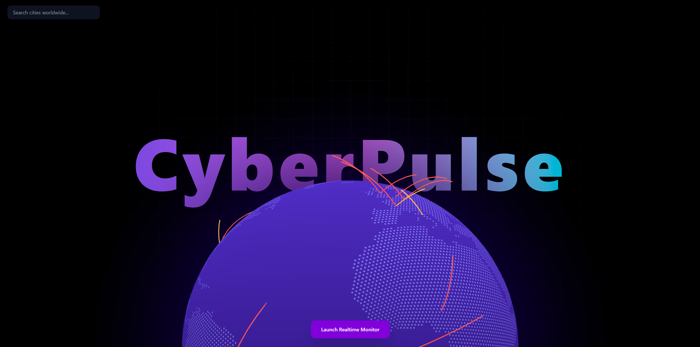
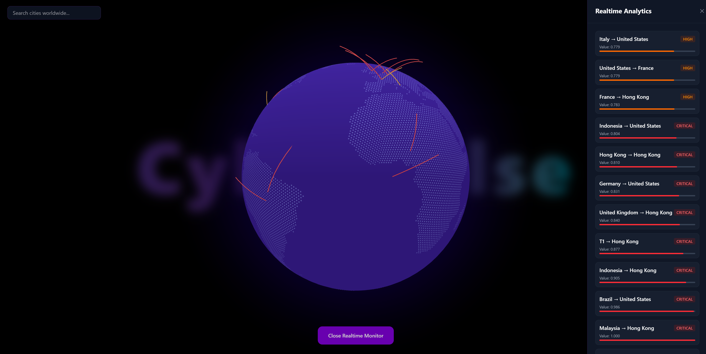
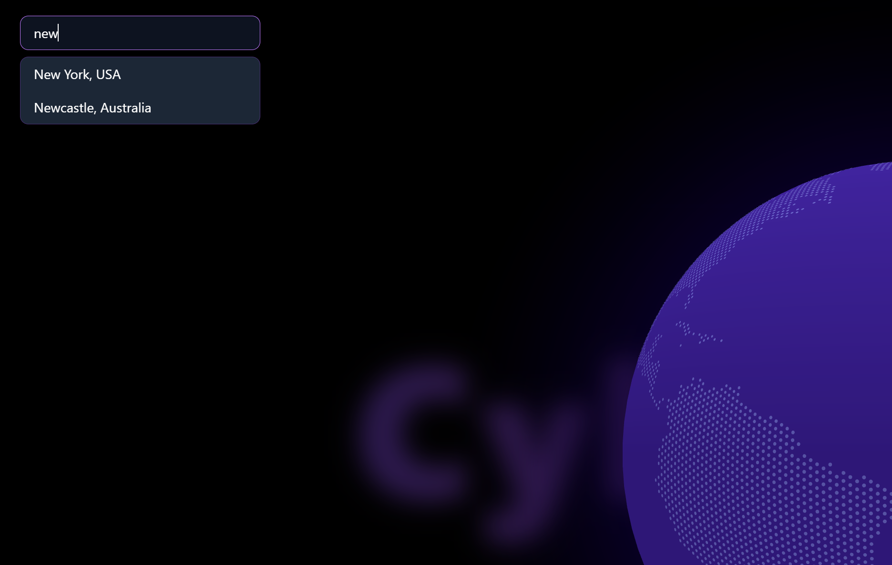

# CyberPulse

CyberPulse is a real-time cyber attack visualization platform that streams global Layer 7 attack activity onto an interactive 3D globe using WebSockets, Redis Pub/Sub, FastAPI, and React.

The platform fetches live cyber attack telemetry from Cloudflare Radar APIs, processes it through a backend publisher service, streams events through Redis Pub/Sub, and visualizes attacks as animated arcs across a globe interface.

---

# Features

* 🌍 Interactive 3D cyber globe visualization
* ⚡ Real-time WebSocket attack streaming
* 🔴 Animated attack arcs between countries
* 💥 Impact pulse effects on target locations
* 📊 Realtime attack analytics dashboard
* 🎯 Top targeted countries tracking
* 🌐 City search & globe focus system
* 🔄 Redis Pub/Sub event pipeline
* 🚀 FastAPI async backend
* 🎨 Modern cyberpunk UI using Framer Motion
* 📡 Live Layer 7 attack monitoring

---

# Tech Stack

## Frontend

* React
* Vite
* Globe.gl
* Three.js
* Framer Motion
* Tailwind CSS
* Chart.js

## Backend

* FastAPI
* Redis
* WebSockets
* AsyncIO
* HTTPX

## Infrastructure

* Docker
* Redis Pub/Sub

---

# Architecture

```text
Cloudflare Radar API
        ↓
Publisher Service
        ↓
Redis Pub/Sub
        ↓
FastAPI WebSocket
        ↓
React Frontend
        ↓
3D Globe Visualization
```

---

# Project Structure

```text
CyberPulse/
│
├── Backend/
│   ├── app/
│   │   ├── routes/
│   │   ├── services/
│   │   ├── utils/
│   │   └── main.py
│   │
│   ├── requirements.txt
│   └── .env
│
├── Frontend/
│   ├── src/
│   │   ├── components/
│   │   ├── hooks/
│   │   ├── services/
│   │   ├── data/
│   │   └── App.jsx
│   │
│   ├── package.json
│   └── vite.config.js
│
└── README.md
```

---

# Installation

## 1. Clone the repository

```bash
git clone https://github.com/yourusername/cyberpulse.git

cd cyberpulse
```

---

# Backend Setup

## 2. Create virtual environment

```bash
python -m venv .venv
```

Activate environment:

### Windows

```bash
.venv\Scripts\activate
```

### Linux/macOS

```bash
source .venv/bin/activate
```

---

## 3. Install backend dependencies

```bash
pip install -r requirements.txt
```

Install WebSocket support:

```bash
pip install "uvicorn[standard]"
```

---

## 4. Start Redis

### Using Docker

```bash
docker run -d --name redis-local -p 6379:6379 redis
```

---

## 5. Configure environment variables

Create `.env` inside `Backend/`

```env
REDIS_URL=redis://localhost:6379
CLOUDFLARE_API_KEY=your_api_key
```

---

## 6. Run FastAPI backend

```bash
uvicorn app.main:app --reload
```

Backend runs on:

```text
http://localhost:8000
```

---

# Frontend Setup

## 7. Install frontend dependencies

```bash
npm install
```

---

## 8. Run frontend

```bash
npm run dev
```

Frontend runs on:

```text
http://localhost:5173
```

---

# WebSocket Endpoint

```text
ws://localhost:8000/ws/attacks
```

---

# Redis Pub/Sub Channel

```text
cyberattacks
```

---

# Attack Event Format

```json
{
  "type": "attack",
  "origin": {
    "code": "IN",
    "name": "India"
  },
  "target": {
    "code": "US",
    "name": "United States"
  },
  "value": 0.42,
  "rank": 20
}
```

---

# Features in Detail

## Realtime Attack Rays

CyberPulse visualizes attacks as animated arcs:

* origin → target travel animation
* dynamic severity coloring
* destination pulse effects
* arc fading and cleanup
* realtime rendering pipeline

---

## Severity Levels

| Severity | Value     |
| -------- | --------- |
| LOW      | < 0.4     |
| MEDIUM   | 0.4 - 0.6 |
| HIGH     | 0.6 - 0.8 |
| CRITICAL | > 0.8     |

---

# Redis Pipeline

```text
Publisher Service
    ↓
Redis Publish
    ↓
FastAPI Subscriber
    ↓
WebSocket Broadcast
    ↓
Frontend Renderer
```

---

# Future Improvements

* 🌎 More accurate geo-coordinates
* 📈 Historical analytics
* 🧠 AI-based threat prediction
* 🔍 Attack filtering
* 📡 Live threat feeds from multiple providers
* 🛰️ Region-specific monitoring
* ☁️ Deployment on cloud infrastructure
* 🔐 Authentication & user dashboards

---

# Screenshots






---

# Development Notes

React StrictMode may trigger duplicate WebSocket mount/unmount behavior during development.

For debugging realtime sockets, temporarily remove:

```jsx
<React.StrictMode>
```

---

# License

MIT License

---

# Author

Mayank Rajguru

Built as a realtime cyber threat visualization platform using modern web technologies.
